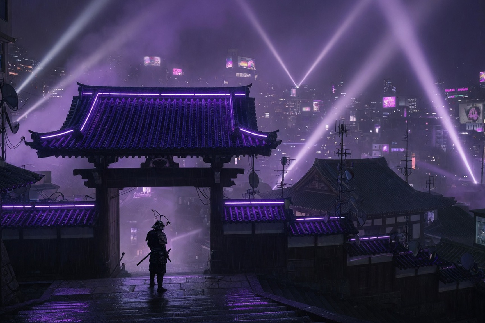
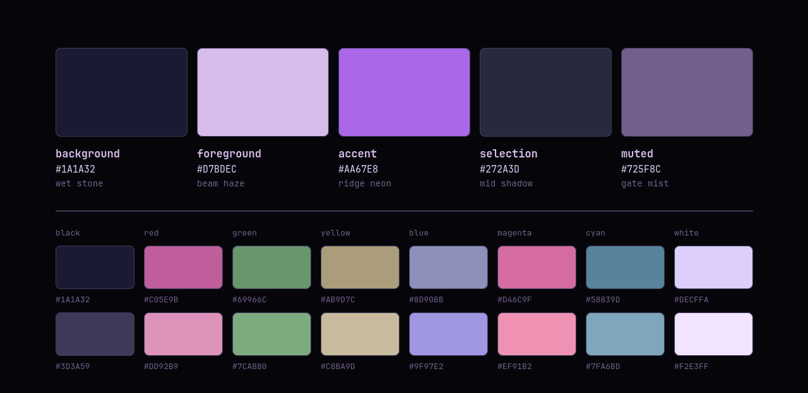
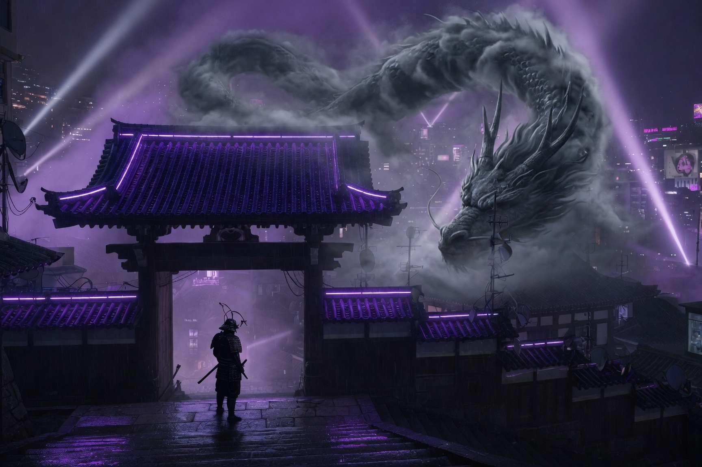

<div align="center">

# Castle Gate

**An [Omarchy](https://omarchy.org/) theme in night indigo, searchlight haze and violet neon.**

A palette sampled from the castle gate wallpaper — pulled off the pixels,
not eyeballed — and carried through every config Omarchy generates: terminals,
editors, the bar, the lock screen, window borders, even the folder icons.



</div>

## The palette

The picture is three colours doing all the work.

**Night indigo, not grey.** The stone is `#1A1A32`, and every darker step
(`#0B0B15`, `#06060A`) keeps that cast. Left alone, Omarchy paints inactive
window borders a neutral grey that appears nowhere in the picture. This theme
sets that border to `selection` instead.

**Searchlight haze.** The clipped core of the beam is nearly white. The
foreground is the lavender paper around it, `#D7BDEC`, so a terminal stays
legible without `#FFFFFF` on the stone.

**Violet neon.** One loud colour, `#AA67E8`, spent on the gate roof. The theme
spends it the same way: the focused window, the selected row, the lock icon,
the keyboard backlight. The focused edge fades from that neon to `#6F5092`,
the lacquer under the ridge.

Green, yellow, and orange are not in the picture. They are dull on purpose, so
diffs and warnings work without a second loud colour. Pink on the signs is
`red` and `magenta`. Cyan is the night water, lifted so it reads on the stone.

## Install

```bash
omarchy theme install https://github.com/jamesbrock/Castle-Gate.git
```

That clones into `~/.config/omarchy/themes/castle-gate` and applies
immediately. Omarchy takes the theme's name from the repo name — lowercased,
with a leading `omarchy-` and trailing `-theme` stripped if present — and the
theme picker title-cases it back, so to return to it later:

```bash
omarchy theme set "Castle Gate"
```

Optional, and worth it — the matching folder icons (see [Icons](#icons)):

```bash
omarchy pkg add papirus-icon-theme
~/.config/omarchy/themes/castle-gate/scripts/install-icons.sh
```

## Palette



| Role | Hex | Taken from |
|---|---|---|
| `background` | `#1A1A32` | wet stair stone |
| `foreground` | `#D7BDEC` | lavender around the searchlight |
| `accent` | `#AA67E8` | violet neon on the gate roof |
| `selection` | `#272A3D` | mid shadow |
| `muted` | `#725F8C` | mist on the timber |

The sheet above is rendered from `colors.toml` by
[`scripts/render-palette.sh`](scripts/render-palette.sh), so it cannot drift
from the values it documents. Re-run it after changing a colour.

## Wallpapers

Two cuts of the same gate, both 1728×1152, 3:2. They ship in `backgrounds/`
and cycle with `omarchy theme bg next`. A fresh `omarchy theme set` picks the
first file.

### 1 · Gate — 1728×1152, 3:2


The gate under the searchlight. The default.

### 2 · Dragon — 1728×1152, 3:2



The same gate, with a dragon coiled in the storm cloud.

Three things to know before adding your own:

- Omarchy's background layer is hardcoded to `PreserveAspectCrop`, with no
  config knob. A wallpaper wider than the screen is centre-cropped and
  magnified, never letterboxed — so cut one per display shape rather than
  hoping one file covers everything.
- Backgrounds are cycled in filename order, which is what the number prefixes
  are for; `backgrounds[0]` is what a fresh `omarchy theme set` picks. Drop new
  images into `backgrounds/` and re-apply the theme. Wallpapers you would
  rather not commit go in `~/.config/omarchy/backgrounds/castle-gate/`
  instead — Omarchy reads both.
- `omarchy theme set <the-current-theme>` advances to the *next* background. To
  pin one, use `omarchy theme bg set <path>`.

## What's in here

```
colors.toml          the palette, and the only file you normally edit
backgrounds/         wallpapers, cycled with `omarchy theme bg next`
  1-castle-gate-laptop.jpg   1728x1152, 3:2
  2-castle-gate-dragon.jpg   1728x1152, 3:2
preview-unlock.png   1920x1080 preview of the boot screen
unlock.png           Plymouth boot logo, the wordmark in violet neon
icons.theme          GTK icon theme name
keyboard.rgb         keyboard backlight colour
shell.bar.toml       top bar glass
shell.lock.toml      lock screen password card
docs/palette.png     the swatch sheet above, generated from colors.toml
scripts/             one-time icon build, and the palette renderer
```

Everything else Omarchy needs is **generated**. `omarchy theme set` runs
`colors.toml` through the templates in `$OMARCHY_PATH/default/themed/*.tpl` and
writes ~17 config files — alacritty, ghostty, kitty, foot, btop, helix, neovim,
hyprland, hyprlock, chromium, obsidian, vscode, the shell and bar — into
`~/.local/state/omarchy/current/theme/`.

Those generated files are rebuilt from scratch on every theme switch, so
editing them is wasted work. Change `colors.toml` and re-apply:

```bash
omarchy theme set "Castle Gate"
```

## Details worth knowing

### Window borders

```toml
hyprland_active_border   = "accent brown 45deg"
hyprland_inactive_border = "selection"
```

A gradient spec is theme colour names plus an optional angle, so the focused
window gets a 45° neon-to-lacquer edge. Most themes leave the second key out;
left unset, Omarchy falls back to a hardcoded `rgba(595959aa)` — a neutral
grey that appears nowhere else in this palette.

### Top bar

`shell.bar.toml` replaces the generated `[bar]` section. The bar is indigo
glass: `background-alpha` is `0.35`, so the wallpaper shows through. The
override replaces the section wholesale, so every key the template sets is
repeated in it. Delete the file to fall back to the generated bar.

### Lock screen

`shell.lock.toml` replaces the generated `[lock]` section. The password card
uses `#0B0B15`, one step under the bar, so it sits inset on the wallpaper.
The override replaces the section wholesale. Delete the file to fall back to
the generated section.

### Icons

`icons.theme` names `CastleGate` — Papirus-Dark with only the folder family
recoloured:

| Papirus | here | what it is |
|---|---|---|
| `#5294e2` | `#AA67E8` | folder front face |
| `#4877b1` | `#6F5092` | folder back tab |
| `#1d344f` | `#1A1A32` | the emblem glyph on the face |
| `#e4e4e4` | `#D7BDEC` | the paper sheet |

**Omarchy never installs an icon theme, so this one has to be built once per
machine:**

```bash
omarchy pkg add papirus-icon-theme
./scripts/install-icons.sh
```

That writes the recoloured SVGs to `~/.local/share/icons/CastleGate` and
leaves everything else falling through to Papirus-Dark. Application icons that
happen to use Papirus blue are deliberately left alone, and the 16x16 set is
symbolic — it follows the text colour already, so it isn't touched. Re-run it
after a Papirus update to pick up new icons.

Until you run it, `icons.theme` names a theme that isn't on disk and GTK falls
back to its default. If you'd rather the theme be self-sufficient, set
`icons.theme` to `Papirus-Dark` and drop the script — you lose the exact colour
match and get Papirus's blue folders back.

> Stock Omarchy themes name a `Yaru-*` variant here and the base package list
> installs `yaru-icon-theme`, but that package is absent from the aarch64
> repos — on ARM the default leaves GTK pointing at an icon theme that was
> never installed.

### Keyboard

`keyboard.rgb` is a single hash-less hex value applied to the keyboard
backlight. Inert without RGB hardware.

## Credit

The colour values in `colors.toml` are original work. The images in
`backgrounds/` are shipped as a starting point under no claim of ownership —
swap in your own.

`unlock.png` and `preview-unlock.png` are Omarchy's own wordmark recoloured to
this palette, the same thing every stock theme ships.

Released under the [MIT License](LICENSE).
